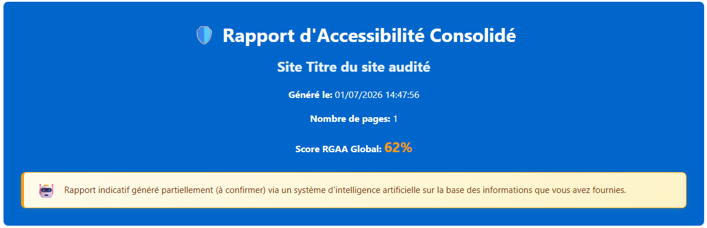
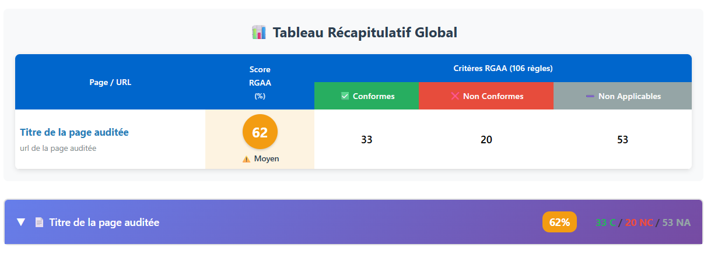
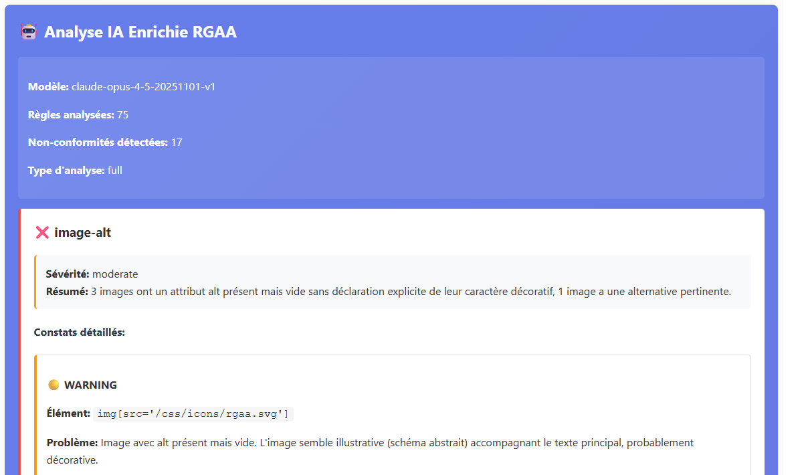
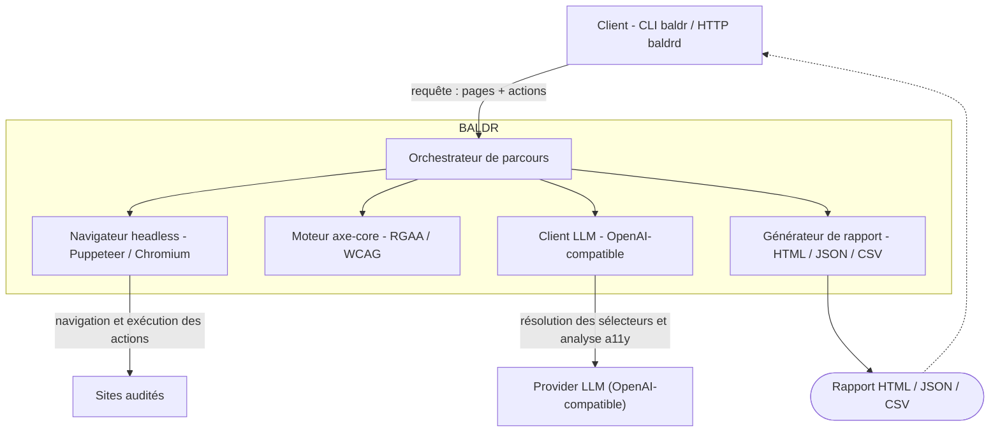
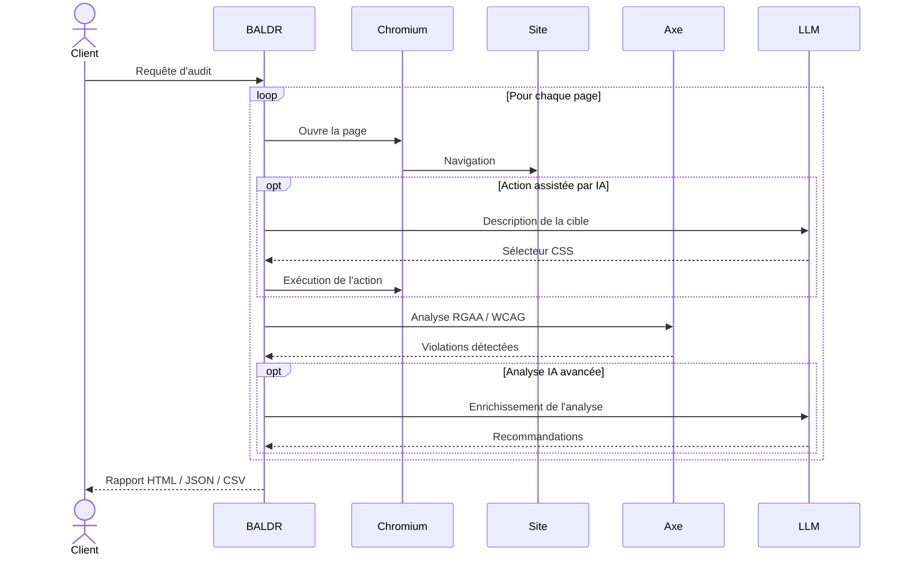

# BALDR Accessibility Scan


## Outil open source d'audit d'accessibilité RGAA et WCAG enrichi par l'Intelligence Artificielle (IA)

Automatisez vos audits d'accessibilité RGAA et WCAG avec axe-core, Puppeteer et l'intelligence artificielle

BALDR Accessibility Scan est un outil open source permettant d'automatiser les audits d'accessibilité web et d'évaluer la conformité des sites et applications web aux référentiels **RGAA** et **WCAG**.

Construit sur **axe-core**, **Puppeteer** et des analyses enrichies par **Intelligence Artificielle (IA)**, BALDR aide les équipes de développement, QA, accessibilité et conformité à détecter les défauts d'accessibilité, calculer un score de conformité et produire des recommandations de correction exploitables.

**Contrairement aux scanners d'accessibilité traditionnels, BALDR analyse des parcours utilisateurs complets, y compris les zones authentifiées, les interactions dynamiques et des analyses enrichies par Intelligence Artificielle (IA).**

---

## Pourquoi BALDR ?

✅ Audit d'accessibilité automatisé

✅ Conformité RGAA et WCAG

✅ Navigation navigateur automatisée avec Puppeteer

✅ Parcours utilisateurs multi-pages

✅ Gestion de l'authentification

✅ Analyse enrichie par IA

✅ Intégration CI/CD

✅ Rapports HTML, JSON et CSV

✅ Recommandations de remédiation

✅ Scoring d'accessibilité

---

## Captures d'écran

### Score de conformité



### Tableau de bord



### Résultats détaillés




---

## Cas d'usage

- Audit d'accessibilité pendant le développement
- Validation avant mise en production
- Intégration dans les pipelines CI/CD
- Contrôle qualité continu
- Suivi de conformité RGAA
- Suivi de conformité WCAG
- Audits d'applications authentifiées

---

## Pour qui ?

- Experts accessibilité
- Développeurs front-end
- Équipes QA
- Product Owners
- Administrations publiques
- Grandes entreprises
- Équipes DevSecOps
- Auditeurs RGAA

---

## Comparaison

| Fonctionnalité | BALDR | axe-core | Lighthouse | Pa11y |
|---------------|--------|-----------|-------------|-------|
| Audit d'accessibilité | ✅ | ✅ | ✅ | ✅ |
| Support RGAA | ✅ | ❌ | ❌ | ❌ |
| Support WCAG | ✅ | ✅ | ✅ | ✅ |
| Parcours multi-pages | ✅ | ❌ | ❌ | ✅ |
| Authentification | ✅ | ❌ | ❌ | ❌ |
| Analyse IA | ✅ | ❌ | ❌ | ❌ |
| Mode CLI | ✅ | ✅ | ✅ | ✅ |
| Mode API | ✅ | ❌ | ❌ | ❌ |
| Rapports HTML | ✅ | ❌ | ✅ | ✅ |
| Intégration CI/CD | ✅ | ✅ | ✅ | ✅ |

Cette comparaison est donnée à titre indicatif et reflète les fonctionnalités disponibles dans BALDR au moment de la rédaction.

---

## Fonctionnalités principales

### Audit d'accessibilité

- Contrôles RGAA
- Contrôles WCAG
- Analyse axe-core
- Scoring de conformité
- Recommandations de correction

### Automatisation

- Navigation Puppeteer
- Gestion des cookies
- Parcours complexes
- Authentification automatique

### Intégration entreprise

- Interface CLI
- API HTTP
- Docker
- CI/CD
- Monitoring

---

## Mots-clés

Accessibilité web, audit d'accessibilité, RGAA, WCAG, scanner d'accessibilité, accessibility testing, accessibility scanner, a11y, conformité numérique, accessibilité CI/CD, automatisation accessibilité, audit RGAA, audit WCAG.

---

## Sommaire

- [Architecture](#architecture)
- [Installation](#installation)
- [Démarrage en 30 secondes](#démarrage-en-30-secondes)
- [La requête d'audit](#la-requête-daudit)
- [Mode CLI (`baldr`)](#mode-cli-baldr)
- [Surcharge des paramètres](#surcharge-des-paramètres)
- [Mode API (`baldrd`)](#mode-api-baldrd)
- [Configuration](#configuration)
- [Sécurité](#sécurité)
- [Développement](#développement)
- [Docker](#docker)
- [Documentation détaillée & licence](#documentation-détaillée--licence)

## Architecture


Il s'utilise de deux façons, à partir du même paquet :

| Binaire  | Mode               | Usage                                                        |
| -------- | ------------------ | ------------------------------------------------------------ |
| `baldr`  | **CLI**            | Auditer une requête localement, exporter HTML/JSON/CSV.      |
| `baldrd` | **API** (serveur HTTP) | Exposer `POST /api/v1/journey`, protégé par clé d'API.   |


BALDR reçoit une **requête d'audit** (CLI ou API), pilote un navigateur headless
pour parcourir les pages, lance un audit **axe-core** — enrichi au besoin par un
**LLM** — et renvoie un rapport. Les deux seuls systèmes externes sont les
**sites audités** (via le navigateur) et le **fournisseur LLM** (compatible
OpenAI).



Le déroulé d'un audit, page par page :



## Installation

Le paquet est publié publiquement sur **npmjs**. Installation globale (fournit
les deux binaires `baldr` et `baldrd`) :

```bash
npm install -g baldr-accessibility-scan
```

> **Prérequis** : Node.js **≥ 22** (24 recommandé).
> L'installation télécharge **Chromium** via Puppeteer (requis par axe-core) —
> compter un téléchargement de ~150 Mo.

Vérifier :

```bash
baldr --version
baldr run --help     # format de requête, authentification, exemples
```

## Démarrage en 30 secondes

### En CLI

Auditer une page publique et écrire le rapport HTML dans un fichier — aucune clé
LLM nécessaire (analyse `static`) :

```bash
echo '{ "pages": [ { "url": "https://www.wikipedia.org" } ] }' \
  | baldr run --format html -o rapport.html
```

Le rapport part sur **stdout** par défaut (donc redirigeable / pipeable) ; `-o`
l'écrit dans un fichier.

### En API

Démarrer le serveur (une clé d'API est **obligatoire**) puis lancer un audit :

```bash
# Terminal 1 — serveur sur http://localhost:3000
API_KEYS=demo:mon-secret baldrd

# Terminal 2 — appel
curl -X POST http://localhost:3000/api/v1/journey \
  -H "X-API-Key: mon-secret" \
  -H "Content-Type: application/json" \
  -d '{ "pages": [ { "url": "https://www.wikipedia.org" } ] }'
```

## La requête d'audit

Le même contrat JSON alimente la CLI et l'API. **Seul `pages` est obligatoire.**

```jsonc
{
  "name": "Audit Espace Client",          // optionnel — titre + nom du fichier de rapport
  "options": {                            // optionnel — config globale d'audit
    "analysisType": "full",               // "static" | "intel" | "full"  (défaut: "full")
    "reportFormat": "html",               // "html" | "json" | "csv"       (défaut: "html")
    "rules": ["1.1", "3.1"],              // optionnel — restreint aux règles RGAA listées
    "viewport": { "width": 1920, "height": 1080 } // optionnel — width ≥ 320, height ≥ 240
  },
  "auth": {                               // optionnel — identifiants du SITE AUDITÉ (défaut global)
    "username": "jdoe",
    "password": "secret"
  },
  "pages": [                              // OBLIGATOIRE — 1 à 30 pages, dans l'ordre
    {
      "url": "https://www.wikipedia.org", // OBLIGATOIRE — http(s), validée anti-SSRF
      "auth": { "username": "...", "password": "..." }, // optionnel — surcharge l'auth racine
      "actions": [                        // optionnel — max 50 ; absent/vide = un scan par défaut
        { "type": "acceptCookies" },
        { "type": "scan" }
      ]
    }
  ]
}
```

### Actions

Chaque action est un objet typé par son champ `type`, exécutées dans l'ordre.

| `type`          | Champs            | IA requise | Description                                              |
| --------------- | ----------------- | :--------: | -------------------------------------------------------- |
| `scan`          | —                 |     non    | Lance l'audit (axe + IA selon `analysisType`) + capture. |
| `acceptCookies` | —                 |     non    | Accepte la bannière cookies (Didomi, OneTrust, Tarteaucitron…). |
| `wait`          | `ms` (1–60000)    |     non    | Pause fixe en millisecondes.                             |
| `click`         | `target`          |   **oui**  | Clique sur l'élément décrit.                             |
| `hover`         | `target`          |   **oui**  | Survole l'élément décrit.                                |
| `fill`          | `target`, `value` |   **oui**  | Saisit `value` dans le champ décrit.                     |
| `select`        | `target`, `value` |   **oui**  | Sélectionne `value` dans la liste décrite.               |
| `ai`            | `instruction`     |   **oui**  | Étape libre en langage naturel (trappe d'évasion).       |

> `target` / `instruction` sont des **descriptions en langage naturel** (« le
> bouton Envoyer », « le champ email »), max 500 caractères : l'IA en déduit le
> sélecteur. Les actions « IA requise » exigent un fournisseur LLM configuré
> (voir [Surcharge des paramètres](#surcharge-des-paramètres)). `scan`,
> `acceptCookies` et `wait` fonctionnent sans IA.

### Types d'analyse

| `analysisType` | Description                                          |
| -------------- | ---------------------------------------------------- |
| `static`       | axe-core seul, sans IA — le plus rapide.             |
| `intel`        | axe + analyse IA ciblée.                             |
| `full`         | audit complet enrichi par IA (défaut) — le plus approfondi. |

### Authentification du site audité

À ne pas confondre avec la clé d'API. Un seul modèle adaptatif :
**identifiant + mot de passe**. Le moteur s'adapte à ce que le site présente
(popup HTTP native, ou formulaire HTML mono- ou bi-étapes).

| Champ      | Requis | Description                                                       |
| ---------- | :----: | ----------------------------------------------------------------- |
| `username` |  oui   | Identifiant (login ou email selon le site).                       |
| `password` |  oui   | Mot de passe.                                                     |
| `loginUrl` |  non   | Page de login si différente de l'URL auditée (auto-détectée sinon). |

`auth` se déclare au niveau **racine** (défaut pour toutes les pages) et/ou
**par page** (`pages[].auth`, qui surcharge la racine). L'omettre = page
publique. Une session réussie est mise en cache (~30 min) et réutilisée entre
les pages. *Non supporté* : SSO transparent (Kerberos/Negotiate sans saisie).

## Mode CLI (`baldr`)

```bash
baldr run [fichier] [options]
```

- La requête est lue depuis `[fichier]`, ou depuis **stdin** s'il est omis.
- Le rapport part sur **stdout**, ou dans un fichier avec `-o`.

| Option                   | Description                                              |
| ------------------------ | -------------------------------------------------------- |
| `-o, --output <path>`    | Écrit le rapport dans un fichier au lieu de stdout.      |
| `--format <html\|json\|csv>` | Force `reportFormat` pour ce run (prime sur le fichier). |
| `--llm-model <model>`    | Voir [Surcharge des paramètres](#surcharge-des-paramètres). |
| `--llm-endpoint <url>`   | idem                                                     |
| `--llm-api-key <key>`    | idem                                                     |
| `--llm-context-limit <n>`| idem                                                     |

```bash
# Depuis un fichier, rapport HTML dans un fichier
baldr run request.json -o rapport.html

# Depuis stdin (pipe ou redirection)
cat request.json | baldr run
baldr run < request.json

# Forcer le format quel que soit options.reportFormat du fichier
baldr run request.json --format json -o rapport.json
```

## Surcharge des paramètres

Le fournisseur LLM se configure **une fois** par variables d'environnement, et
peut être surchargé **par run** via des flags CLI. Précédence :
**flag > variable d'env > défaut**.

| Flag CLI               | Variable d'env          | Défaut                       |
| ---------------------- | ----------------------- | ---------------------------- |
| `--llm-model`          | `LLM_PROVIDER_MODEL`    | `gpt-4o`                     |
| `--llm-endpoint`       | `LLM_PROVIDER_ENDPOINT` | `https://api.openai.com/v1`  |
| `--llm-api-key`        | `LLM_PROVIDER_API_KEY`  | — (sa présence active l'IA)  |
| `--llm-context-limit`  | `LLM_CONTEXT_LIMIT`     | auto-détecté                 |

```bash
# Activer l'IA pour ce run seulement et choisir le modèle
baldr run request.json -o rapport.html \
  --llm-api-key sk-xxxx --llm-model gpt-4o

# Pointer vers un endpoint interne compatible OpenAI
baldr run request.json -o rapport.html \
  --llm-endpoint https://llm.interne.acme.corp/v1 \
  --llm-api-key sk-xxxx --llm-context-limit 128000
```

> ⚠️ `--llm-api-key` apparaît dans `ps` et l'historique shell — préférer la
> variable d'environnement pour les secrets en usage partagé.
>
> **Endpoint** : `LLM_PROVIDER_ENDPOINT` doit inclure le segment `/v1`
> (ex. `https://api.openai.com/v1`).

## Mode API (`baldrd`)

### Lancer le serveur

```bash
API_KEYS=client-a:secret-long-et-aleatoire baldrd
```

- `API_KEYS` est **obligatoire** (le serveur refuse de démarrer sans) — format
  `id:secret`, plusieurs entrées séparées par des virgules. Pas de mode ouvert.
- Le port d'écoute est `3000` par défaut, configurable via `PORT`.
- URL de base : `http://<host>:<PORT>/api/v1` (sauf `/metrics`, à la racine).

### Authentification

Chaque requête vers un endpoint protégé porte l'en-tête `X-API-Key: <secret>`.
Le secret est comparé en **temps constant** ; absent ou invalide → **401**.

### Endpoints

| Méthode | Chemin                        | `X-API-Key` | Description                                  |
| ------- | ----------------------------- | :---------: | -------------------------------------------- |
| `POST`  | `/api/v1/journey`             |     oui     | Lance un parcours d'audit multi-pages.       |
| `GET`   | `/api/v1/health`              |     non     | Sonde de vivacité (toujours `200`).          |
| `GET`   | `/api/v1/health/diagnostic`   |     non     | Diagnostic config + connectivité LLM (`200`/`503`). |
| `GET`   | `/metrics`                    |     oui     | Métriques Prometheus.                        |
| `GET`   | `/api/v1/docs`                |     non     | Documentation OpenAPI (si `EXPOSE_API_DOCS=true`). |

En cas de succès (`200`), le corps de la réponse est **directement le rapport**
dans le format demandé (avec un `Content-Disposition` qui le fait télécharger
par un navigateur), pas une enveloppe JSON.

### Exemples

**1. Page publique, rapport JSON**

```bash
curl -X POST http://localhost:3000/api/v1/journey \
  -H "X-API-Key: mon-secret" -H "Content-Type: application/json" \
  -d '{
    "name": "Accueil Wikipedia",
    "options": { "analysisType": "static", "reportFormat": "json" },
    "pages": [ { "url": "https://www.wikipedia.org" } ]
  }'
```

**2. Parcours avec actions typées et trappe IA** (nécessite un LLM configuré)

```bash
curl -X POST http://localhost:3000/api/v1/journey \
  -H "X-API-Key: mon-secret" -H "Content-Type: application/json" \
  -d '{
    "name": "Parcours de connexion",
    "options": { "analysisType": "full", "reportFormat": "html" },
    "pages": [
      {
        "url": "https://the-internet.herokuapp.com/login",
        "actions": [
          { "type": "fill", "target": "le champ Username", "value": "tomsmith" },
          { "type": "fill", "target": "le champ Password", "value": "SuperSecretPassword!" },
          { "type": "click", "target": "le bouton Login" },
          { "type": "wait", "ms": 1500 },
          { "type": "scan" }
        ]
      }
    ]
  }'
```

**3. Parcours authentifié multi-pages** (l'`auth` racine s'applique à toutes les pages)

```bash
curl -X POST http://localhost:3000/api/v1/journey \
  -H "X-API-Key: mon-secret" -H "Content-Type: application/json" \
  -d '{
    "name": "Audit espace protégé",
    "options": { "analysisType": "full", "reportFormat": "html" },
    "auth": { "username": "standard_user", "password": "secret_sauce" },
    "pages": [
      { "url": "https://www.saucedemo.com/inventory.html" },
      { "url": "https://www.saucedemo.com/cart.html" }
    ]
  }'
```

### Format des erreurs

```json
{ "success": false, "error": { "code": "VALIDATION_ERROR", "message": "…" } }
```

| Code  | `error.code`            | Cas                                                       |
| ----- | ----------------------- | --------------------------------------------------------- |
| `400` | `VALIDATION_ERROR`      | Corps invalide : `pages` manquant, URL bloquée (SSRF), action mal typée, > 30 pages, > 50 actions… |
| `401` | `UNAUTHORIZED`          | `X-API-Key` manquant ou invalide.                         |
| `429` | _(message texte)_       | Rate limiting dépassé.                                    |
| `500` | `INTERNAL_SERVER_ERROR` | Erreur interne (un `requestId` est inclus).               |

## Configuration

Toutes les variables sont validées au démarrage ; une valeur requise manquante
ou invalide stoppe le boot avec un message explicite. Modèle complet et
commentaires : **[`.env.example`](./.env.example)**.

| Variable                | Requis | Défaut                      | Rôle                                            |
| ----------------------- | :----: | --------------------------- | ----------------------------------------------- |
| `API_KEYS`              | **oui**| —                           | Clés d'API (`id:secret`, séparées par `,`).     |
| `PORT`                  |  non   | `3000`                      | Port d'écoute du serveur.                        |
| `LLM_PROVIDER_API_KEY`  |  non   | —                           | Active l'IA (sans clé → audit axe seul).        |
| `LLM_PROVIDER_ENDPOINT` |  non   | `https://api.openai.com/v1` | Base URL OpenAI-compatible (inclure `/v1`).     |
| `LLM_PROVIDER_MODEL`    |  non   | `gpt-4o`                    | Modèle utilisé.                                 |
| `LLM_CONTEXT_LIMIT`     |  non   | auto                        | Fenêtre de contexte (tokens) si auto-détection fausse. |
| `HTTPS_PROXY`           |  non   | —                           | Proxy sortant (LLM + pages auditées).           |
| `RATE_LIMIT_WINDOW_MS` / `RATE_LIMIT_MAX` | non | `900000` / `100` | Quota par IP.                          |
| `CORS_ORIGIN`           |  non   | _(vide = tout bloqué)_      | Origines autorisées, séparées par `,`.          |
| `EXPOSE_API_DOCS`       |  non   | `false`                     | Expose la doc OpenAPI sur `/api/v1/docs`.       |

> En **CLI** comme en **serveur**, un fichier `.env` du répertoire courant est
> lu automatiquement. Pour un binaire installé globalement et déployé, passer
> plutôt par les variables d'environnement.

## Sécurité

- **Clé d'API obligatoire** (`X-API-Key`) sur `/api/v1/journey` et `/metrics` ;
  comparaison en temps constant.
- **Anti-SSRF** : les URLs vers IP privées, `localhost`, métadonnées cloud
  (`169.254.169.254`), loopback IPv6 ou schémas non-HTTP sont rejetées (`400`).
  Allowlist explicite possible via `BALDR_SSRF_ALLOW_HOSTS`.
- Les **mots de passe** du site audité ne sont ni persistés ni loggés.
- Déploiement attendu en **réseau privé**, derrière **HTTPS**, avec un **CORS** restrictif.

## Développement

```bash
git clone https://github.com/malakoffhumanis/baldr-accessibility-scan.git
cd baldr-accessibility-scan
npm install
cp .env.example .env        # renseigner API_KEYS (obligatoire) + le LLM si besoin
```

| Commande                       | Effet                                               |
| ------------------------------ | --------------------------------------------------- |
| `npm run dev`                  | **Serveur** en mode dev, hot-reload (`tsx watch`).  |
| `npm run dev:cli -- run req.json -o out.html` | **CLI** en mode dev (sans build).    |
| `npm run build`                | Compile TypeScript → `dist/`.                       |
| `npm start`                    | Lance le serveur depuis `dist/` (production).       |
| `npm run check`                | Lint + typecheck + tests.                           |
| `npm test`                     | Tests (Vitest).                                     |

Le serveur dev écoute sur `http://localhost:3000`.

Avant de proposer une contribution, lire le guide
**[CONTRIBUTING.md](./CONTRIBUTING.md)** (workflow, conventions, exigences de
PR) et le [code de conduite](./CODE_OF_CONDUCT.md).

## Docker

L'image **ne build rien** : le `Dockerfile` copie un `dist/` et un
`node_modules/` **déjà produits**, et installe Chromium via apt. Le pré-build
doit tourner sur **linux** (runner CI ubuntu ou conteneur linux) avec
`--omit=dev`, pour un `node_modules` compatible avec l'image `node:24-slim`.
Tout passe par le [`Makefile`](./Makefile) :

```bash
# 1. Pré-build (sur linux) : produit dist/ + node_modules de production
make build

# 2. Construire l'image (copie les artefacts, installe Chromium)
make docker IMAGE=moncompte/baldr TAG=1.0.0

# 3. Lancer le conteneur (le CMD démarre le serveur baldrd)
docker run -d -e API_KEYS=client:secret -p 3000:3000 moncompte/baldr:1.0.0
```

> Sur macOS, faire le pré-build dans un conteneur linux pour la compatibilité :
> `docker run --rm -v "$PWD":/app -w /app node:24 sh -c "npm ci && npm run build && npm prune --omit=dev"`

**Port configurable** (build et runtime) :

```bash
make docker PORT=8080                    # fige le port par défaut dans l'image
docker run -e PORT=8080 -p 8080:8080 …   # surcharge au runtime (EXPOSE/HEALTHCHECK suivent)
```

**Exécution durcie** (recommandé en prod — l'image tourne déjà en non-root avec
`tini` comme PID 1) :

```bash
docker run -d -e API_KEYS=client:secret -p 3000:3000 \
  --cap-drop=ALL --security-opt no-new-privileges \
  --read-only --tmpfs /tmp \
  moncompte/baldr:1.0.0
```

**Multi-arch + push** (attestations provenance + SBOM ; nécessite
`docker buildx create --use`) :

```bash
make buildx IMAGE=<registre>/baldr TAG=1.0.0 PLATFORMS=linux/amd64,linux/arm64
make release IMAGE=<registre>/baldr TAG=1.0.0   # raccourci : build + docker + push
```

Apache-2.0 — voir [LICENSE](./LICENSE) et [NOTICE](./NOTICE).
